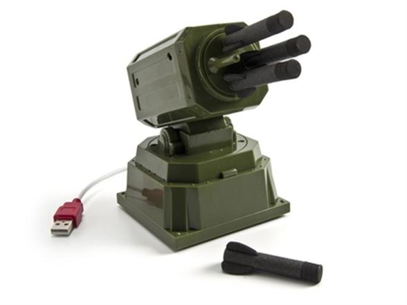

# dream-cheeky-thunder

A self-hosted REST API to control the [Dream Cheeky USB Thunder missile launcher](http://www.dreamcheeky.com/thunder-missile-launcher) over HTTP.

The API is built with Python and FastAPI, packaged as a Docker image. Once running, you can aim and fire the launcher from any HTTP client, script, or browser. A web UI is served at `http://localhost:8000`.

---

## Hardware

| Spec | Value |
|------|-------|
| USB Vendor ID | `0x2123` |
| USB Product ID | `0x1010` |
| Yaw (horizontal) | -135° to +135° |
| Pitch (vertical) | -5° to +45° |
| Missile capacity | 4 foam missiles |
| Inter-shot delay | 4.5 seconds |

---

## Documentation

- [Setup: Linux](docs/setup-linux.md)
- [Setup: Windows (Docker Desktop + WSL2)](docs/setup-windows-wsl2.md)
- [API Reference](docs/api.md)
- [Development](docs/development.md)
